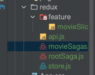

## Understand Redux Toolkit API


# Section 2: Project 1 - Cocktail app with redux toolkit

## Understand createAsyncThunk
`npx create-react-app redux-toolkit-cocktail`  
`npm i react-router-dom react-redux @reduxjs/toolkit`  

## Working on Header

## Configure and Writing 1st action with Redux Toolkit

_redux-toolkit-cocktail/src/redux/features/cocktailSlice.js_
```js
import {createSlice, createAsyncThunk} from "@reduxjs/toolkit";

export const fetchCocktails = createAsyncThunk(
  "cocktails/fetchCocktails",
  async () => {
    return fetch("http://www.thecocktaildb.com/api/json/v1/1/search.php?s=")
      .then(res => res.json())
  }
)

const cocktailSlice = createSlice({
  name: "cocktails",
  initialState: {
    cocktails: [],
    cocktail: [],
    loading: false,
    error: null,
  },
  extraReducers: {
    [fetchCocktails.pending]: (state, action) => {
      state.loading = true;
    },
    [fetchCocktails.fulfilled]: (state, action) => {
      state.cocktails = action.payload.drinks
      state.loading = false;
    },
    [fetchCocktails.rejected]: (state, action) => {
      state.loading = false;
      state.error = action.payload;
    }
  }
})

const CocktailReducer = cocktailSlice.reduer;

export {CocktailReducer};
```

_redux-toolkit-cocktail/src/redux/store.js_
```js
import {configureStore} from "@reduxjs/toolkit";
import {CocktailReducer} from "./features/cocktailSlice";

export const store = configureStore ({
  reducer: {
    app: CocktailReducer
  }
})
```

## Search Component
commit  

## Render Cocktails using Redux Toolkit Actions

_redux-toolkit-cocktail/src/component/CocktailList.js_
```js
import {fetchCocktails} from "../redux/features/cocktailSlice";
//...
  useEffect(() => {
    dispatch(fetchCocktails());
  }, []);
```
## createAsyncThunk Action to Fetch Single Cocktail
## Working on Single Cocktail

## Searching with createAsyncThunk Action

_redux-toolkit-cocktail/src/redux/features/cocktailSlice.js_
```js
//...

export const fetchSearchCocktail = createAsyncThunk(
  "cocktails/fetchSearchCocktails",
  async ({searchText}) => {
    return fetch(`https://www.thecocktaildb.com/api/json/v1/1/search.php?s=${searchText}`)
      .then(res => res.json())
  }
)
//...

const cocktailSlice = createSlice({
  name: "cocktails",
  initialState: {
    cocktails: [],
    cocktail: [],
    loading: false,
    error: null,
  },
  extraReducers: {
    [fetchSearchCocktail.pending]: (state, action) => {
      state.loading = true;
    },
    [fetchSearchCocktail.fulfilled]: (state, action) => {
      state.cocktails = action.payload.drinks
      state.loading = false;
    },
    [fetchSearchCocktail.rejected]: (state, action) => {
      state.loading = false;
      state.error = action.payload;
    }
  }
})
```
_redux-toolkit-cocktail/src/component/SearchInput.js_
```js
  const handleChange = () => {
    const searchText = searchValue.current.value;
    dispatch(fetchSearchCocktail({searchText}))
  }

<input type="text" name="name" id="name" ref={searchValue} onChange={handleChange} />

```

# Section 3. Project 2 - CRUD with redux toolkit

## Set-up

https://jsonplaceholder.typicode.com/  

`npm i -D antd @reduxjs/toolkit react-router-dom react-redux`  

_crud-api-toolkit/src/index.js_
```js
import "antd/dist/antd.css";
```

## Structuring

## Basic form

## Configuration & Writing GET Action using createAsyncThunk

_postSlice_
```js
import {createAsyncThunk, createSlice} from "@reduxjs/toolkit";


export const getPost = createAsyncThunk(
  "post/getPost",
  async ({id}) =>{
    return fetch(`https://jsonplaceholder.typicode.com/posts/${id}`)
      .then(res => res.json());
  }
)

const postSlice = createSlice({
  name: 'post',
  initialState: {
    post: [],
    loading: false,
    error: null,
  },
  extraReducers: {
    [getPost.pending]: (state, action) => {
      state.loading = true
    },
    [getPost.fulfilled]: (state, action) => {
      state.loading = false;
      state.post = [action.payload];
    },
    [getPost.rejected]: (state, action) => {
      state.loading = false;
      state.error = action.payload;
    }
  }
})

export default postSlice.reducer;
```

_store.js_
```js
import {configureStore} from "@reduxjs/toolkit";
import PostReducer from "./features/postSlice"

export default configureStore({
  reducer: {
    app: PostReducer,
  }
})
```

_index.js_
```js
import {Provider} from "react-redux";
import store from "./redux/store";
<Provider store={store}>
  <App />
</Provider>
```

## Dispatch GET createAsyncThunk Action

_index.js_
```js
const Home = () => {
  const [id, setId] = useState();

  const dispatch = useDispatch();
  const {loading, post} = useSelector((state) => ({...state.app}))

  const fetchUserPost = () => {
    if (!id) {
      window.alert("Please provide post id")
    } else {
      dispatch(getPost({id}))
      setId("");
    }
  }

  <Button type="primary" onClick={fetchUserPost}>Fetch User post</Button>
  {loading ? <LoadingCard count={1} /> : (
    <>
      {post.length > 0 && (
        <div className="site-card-border-less-wrapper">
          <Card type="inner" title={post[0].title}>
            <p>User id: {post[0].id}</p>
            <span>{post[0].body}</span>
          </Card>
        </div>
      )}
    </>
  )}
```

## Adding buttons

## DELETE with createAsyncThunk

_postSlice.js_
```js
export const deletePost = createAsyncThunk(
  "post/deletePost",
  async ({id}) =>{
    return fetch(`https://jsonplaceholder.typicode.com/posts/${id}`, {
      method: "DELETE"
    })
      .then(res => res.json());
  }
)


const postSlice = createSlice({
  name: 'post',
  initialState: {
    post: [],
    loading: false,
    error: null,
  },
  extraReducers: {
    //...
  }
    [deletePost.pending]: (state, action) => {
      state.loading = true
    },
    [deletePost.fulfilled]: (state, action) => {
      state.loading = false;
      state.post = action.payload;
    },
    [deletePost.rejected]: (state, action) => {
      state.loading = false;
      state.error = action.payload;
    }
```

_index.js_
```js
import {deletePost, getPost} from "../redux/features/postSlice";
//...
    <Button
      onClick={() => dispatch(deletePost({id: post[0].id}))}
    >
```

## POST action with createAsyncThunk

_postSlice_
```js
export const createPost = createAsyncThunk(
  "post/createPost",
  async ({values}) =>{
    return fetch(`https://jsonplaceholder.typicode.com/posts/`, {
      method: "POST",
      headers: {
        Accept: "application/json",
        "Content-type": "application/json"
      },
      body: JSON.stringify({
        title: values.title,
        body: values.body
      })
    })
      .then(res => res.json());
  }
)
```

## Create Post Form
## Dispatch POST createAsyncThunk action

## PUT action with createAsyncThunk
We'll have edit mode  

_postSlice_
```js
const postSlice = createSlice({
  name: 'post',
  initialState: {
//...
    body: "",
    edit: false
  },
  reducers: {
    setEdit: (state, action) => {
      state.edit = action.payload.edit;
      state.body = action.payload.body;
    }
  },

export const {setEdit} = postSlice.actions;
```

## Populate post data on form

```js

                <Button
                  style={{ cursor: 'pointer' }}
                  type="primary"
                  onClick={() => {dispatch(setEdit({edit: true, body: post[0].body}))}}
                >Edit</Button>
```

## Dispatch PUT createAsyncThunk action to Update

_index.js_
```js
    const [bodyText, setBodyText] = useState();
    const {loading, post, edit, body} = useSelector((state) => ({...state.app}))
    useEffect(() => {
      if (body) {
        setBodyText(body);
      }
    }, [body])

    {edit ? (
      <>
        <Input.TextArea
          rows={4}
          value={bodyText}
          onChange={(e) => {setBodyText(e.target.value)}}
        />
        <Space size="middle" style={{ marginTop: 5, marginLeft: 5 }}>
          <Button
            type="primary"
            onClick={() => {
              dispatch(updatePost({
                id: post[0].id,
                title: post[0].title,
                body: bodyText
              }));
              dispatch(setEdit({edit: false, body: ''}))
            }}
          >
            Save
          </Button>
          <Button
            onClick={() => {
              dispatch(setEdit({edit: false, body: ''}))
            }}
          >Cancel</Button>
        </Space>
      </>
    ) : (
      <span>{post[0].body}</span>
    )}
    
    //...
    <Button
      style={{ cursor: 'pointer' }}
      type="primary"
      onClick={() => {dispatch(setEdit({edit: true, body: post[0].body}))}}
    >Edit</Button>
```

# Section 4. Project 3 - RTK query random user app

## What is RTK query?

RTK is built into redux toolkit  
- createApi() - define set of endpoint to fetch data  
- fetchBaseQuery() - wrapper around fetch to simplify request
- <ApiProvider /> - can be used as Provider if you don't have store
- setUpListeners() - utility to enable `refetchOnMoun` and `refetchOnReconnect`

## Project setup

`npx create-react-app rtk-random-user --template redux`  
`npm i react-icons`

## Configure RTK and Writing 1st Query

_rtk-random-user/src/services/user.js_
```js
import {createApi, fetchBaseQuery} from "@reduxjs/toolkit/dist/query/react";

export const usersApi = createApi({
  reducerPath: "users",
  baseQuery: fetchBaseQuery({
    baseUrl: "https://randomuser.me"
  }),
  endpoints: builder => ({
    getUsers: builder.query({
      query: () => "api"
    })
  })
})

export const {useGetUsersQuery} = usersApi;
```

_rtk-random-user/src/app/store.js_
```js
import { configureStore } from '@reduxjs/toolkit';
import {usersApi} from "../services/user";
import {setupListeners} from "@reduxjs/toolkit/query";

export const store = configureStore({
  reducer: {
    [usersApi.reducerPath]: usersApi.reducer
  },
  middleware: (getDefaultMiddleware) => getDefaultMiddleware().concat(usersApi.middleware)
})

setupListeners(store.dispatch);
```

# Section 5. Project 4 - RTK query CRUD app

## Set up
`npx create-react-app rtk-crud --template redux-typescript`  
remove /features, remove /app folders  
`npm i react-router-dom react-toastify`

## Configure and Writing First RTK Query
_rtk-crud/src/services/contactsApi.tsx_
```js
import {createApi, fetchBaseQuery} from "@reduxjs/toolkit/dist/query/react";
import {Contact} from "../model/contact.model";

export const contactsApi = createApi({
    reducerPath: "contactsApi",
    baseQuery: fetchBaseQuery({baseUrl: "http://localhost:5000"}),
    endpoints: (builder) => ({
        contacts: builder.query<Contact[], void>({
            query: () => "/contacts",
        })
    })
})

export const {useContactsQuery} = contactsApi;
```

_rtk-crud/src/store.tsx_
```js
import {contactsApi} from "./services/contactsApi";
import {configureStore} from "@reduxjs/toolkit";

export const store = configureStore({
    reducer: {
        [contactsApi.reducerPath]: contactsApi.reducer
    },
    middleware: (getDefaultMiddleware) => getDefaultMiddleware().concat(contactsApi.middleware)
})
```

## Show Data with RTK Query
_rtk-crud/src/pages/Home.tsx_
```js
const Home = () => {
    const {data, isLoading, error} = useContactsQuery();
//...
  <tbody>
    {data?.map((item, index) => {
      return (
        <tr key={item.id}>
```

## Handling Error with RTK Query
_App.tsx_
```js
import "react-toastify/dist/ReactToastify.css"
import {ToastContainer} from "react-toastify";
//...
<BrowserRouter>
  <ToastContainer />
  <Routes>
```

## Working on POST RTK Query
_contactsApi.tsx_
```js
export const contactsApi = createApi({
    reducerPath: "contactsApi",
    baseQuery: fetchBaseQuery({baseUrl: "http://localhost:5000"}),
    endpoints: (builder) => ({
//...
        addContact: builder.mutation<{}, Contact>({
            query: (contact) => ({
                url: '/contacts',
                method: 'POST',
                body: contact
            })
        })
    })
})

export const {
//...
  useAddContactMutation
} = contactsApi;
```

## User RTK Query to add data

```js
  const handleSubmit = async (e: any) => {
    e.preventDefault();
    if (!name && !email && !contact) {
        toast.error("Please provide value into each input field");
    } else {
        await addContact(formValue);
        navigate("/");
        toast.success("Contact Added Successfully");
    }
  };
```

## Delete with RTK Query
`tagTypes, provideTags, invalidatesTags`  
read more about invalidation  

```js
export const contactsApi = createApi({
    reducerPath: "contactsApi",
    baseQuery: fetchBaseQuery({baseUrl: "http://localhost:5000"}),
    tagTypes: ["Contact"],
    endpoints: (builder) => ({
        contacts: builder.query<Contact[], void>({
            query: () => "/contacts",
            providesTags: ["Contact"]
        }),
        addContact: builder.mutation<{}, Contact>({
            query: (contact) => ({
                url: '/contacts',
                method: 'POST',
                body: contact
            }),
            invalidatesTags: ["Contact"]
        }),
        deleteContact: builder.mutation<void, string>({
            query: (id) => ({
                url: `/contacts/${id}`,
                method: "DELETE",
            }),
            invalidatesTags: ["Contact"],
        }),
    })
})
```

# Section 6. Project 5 - Movie App with Redux-saga & redux-toolkit

## Project setup
`npx create-react-app movie-app`  
`npm install @mui/material @emotion/react @emotion/styled`  
`npm install react-redux @reduxjs/toolkit redux-saga react-router-dom axios`

## Configure OMDB movie api key

https://www.omdbapi.com/  

## App structure and cleanup

## Configure redux-toolkit & redux-saga



_movie-app/src/redux/feature/movieSlice.js_
```js
import {createSlice} from '@reduxjs/toolkit';

const movieSlice = createSlice({
  name: 'movie',
  initialState: {
    movieList: [],
    movie: {}
  }
})

export default movieSlice.reducer;
```

_movie-app/src/redux/store.js_ 
```js
import {configureStore} from "@reduxjs/toolkit";
import createSagaMiddleware from 'redux-saga';
import MovieReducer from './feature/movieSlice';
import rootSaga from './rootSaga';

const sagaMiddleware = createSagaMiddleware();

const store = configureStore({
  reducer: {
    movie: MovieReducer
  },
  middleware: (getDefaultMiddleware) => getDefaultMiddleware().concat(
    sagaMiddleware
  )
})

// sagaMiddleware.run(rootSaga);

export default store;
```

__
```js
import {Provider} from "react-redux";
import store from "./redux/store";

  <Provider store={store} >
    <React.StrictMode>
      <App />
    </React.StrictMode>
  </Provider>
```
