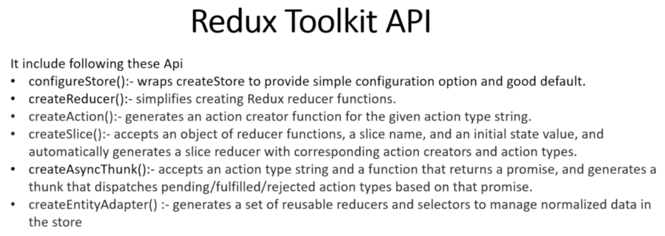

## Understand Redux Toolkit API


# Section 2: Project 1 - Cocktail app with redux toolkit

## Understand createAsyncThunk
`npx create-react-app redux-toolkit-cocktail`  
`npm i react-router-dom react-redux @reduxjs/toolkit`  

## Working on Header

## Configure and Writing 1st action with Redux Toolkit

_redux-toolkit-cocktail/src/redux/features/cocktailSlice.js_
```js
import {createSlice, createAsyncThunk} from "@reduxjs/toolkit";

export const fetchCocktails = createAsyncThunk(
  "cocktails/fetchCocktails",
  async () => {
    return fetch("http://www.thecocktaildb.com/api/json/v1/1/search.php?s=")
      .then(res => res.json())
  }
)

const cocktailSlice = createSlice({
  name: "cocktails",
  initialState: {
    cocktails: [],
    cocktail: [],
    loading: false,
    error: null,
  },
  extraReducers: {
    [fetchCocktails.pending]: (state, action) => {
      state.loading = true;
    },
    [fetchCocktails.fulfilled]: (state, action) => {
      state.cocktails = action.payload.drinks
      state.loading = false;
    },
    [fetchCocktails.rejected]: (state, action) => {
      state.loading = false;
      state.error = action.payload;
    }
  }
})

const CocktailReducer = cocktailSlice.reduer;

export {CocktailReducer};
```

_redux-toolkit-cocktail/src/redux/store.js_
```js
import {configureStore} from "@reduxjs/toolkit";
import {CocktailReducer} from "./features/cocktailSlice";

export const store = configureStore ({
  reducer: {
    app: CocktailReducer
  }
})
```

## Search Component
commit  

## Render Cocktails using Redux Toolkit Actions

_redux-toolkit-cocktail/src/component/CocktailList.js_
```js
import {fetchCocktails} from "../redux/features/cocktailSlice";
//...
  useEffect(() => {
    dispatch(fetchCocktails());
  }, []);
```
## createAsyncThunk Action to Fetch Single Cocktail
## Working on Single Cocktail

## Searching with createAsyncThunk Action

_redux-toolkit-cocktail/src/redux/features/cocktailSlice.js_
```js
//...

export const fetchSearchCocktail = createAsyncThunk(
  "cocktails/fetchSearchCocktails",
  async ({searchText}) => {
    return fetch(`https://www.thecocktaildb.com/api/json/v1/1/search.php?s=${searchText}`)
      .then(res => res.json())
  }
)
//...

const cocktailSlice = createSlice({
  name: "cocktails",
  initialState: {
    cocktails: [],
    cocktail: [],
    loading: false,
    error: null,
  },
  extraReducers: {
    [fetchSearchCocktail.pending]: (state, action) => {
      state.loading = true;
    },
    [fetchSearchCocktail.fulfilled]: (state, action) => {
      state.cocktails = action.payload.drinks
      state.loading = false;
    },
    [fetchSearchCocktail.rejected]: (state, action) => {
      state.loading = false;
      state.error = action.payload;
    }
  }
})
```
_redux-toolkit-cocktail/src/component/SearchInput.js_
```js
  const handleChange = () => {
    const searchText = searchValue.current.value;
    dispatch(fetchSearchCocktail({searchText}))
  }

<input type="text" name="name" id="name" ref={searchValue} onChange={handleChange} />

```

# Section 3. Project 2 - CRUD with redux toolkit

## Set-up

https://jsonplaceholder.typicode.com/  

`npm i -D antd @reduxjs/toolkit react-router-dom react-redux`  

_crud-api-toolkit/src/index.js_
```js
import "antd/dist/antd.css";
```

## Structuring

## Basic form

